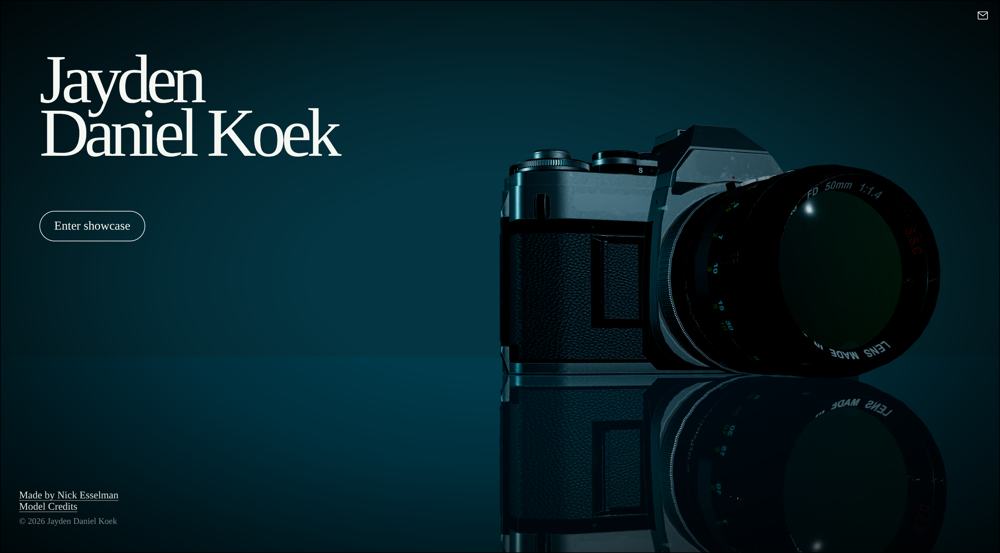
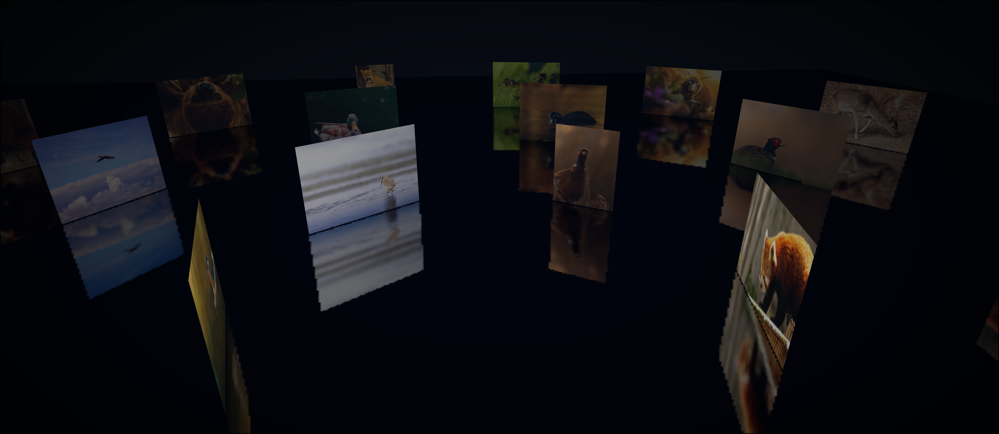

# Jayden Daniel Koek Photogrophy




This is a portfolio site for my good friend Jayden, a photographer. I made it to learn 3D web design with Threlte and to give visitors a way to walk through Jayden's images instead of only scrolling past them. It is a project for [#beest](https://hackclub.com/).

## Tech stack
- [SvelteKit](https://kit.svelte.dev/) for routing and the site shell
- [Threlte](https://threlte.xyz/) and [Three.js](https://threejs.org/) for the 3D scenes
- Blender for the camera and film assets
- Docker Compose for deployment

## Run locally

```bash
npm install
npm run dev
```

## Deploy with Docker

Create a local `.env` from the example and add the contact details:

```bash
cp .env.example .env
docker compose up --build -d
```

The container listens only on `127.0.0.1:3405`; place a reverse proxy in front of it for the public site. I made it this way to supprt my own caddy setup
