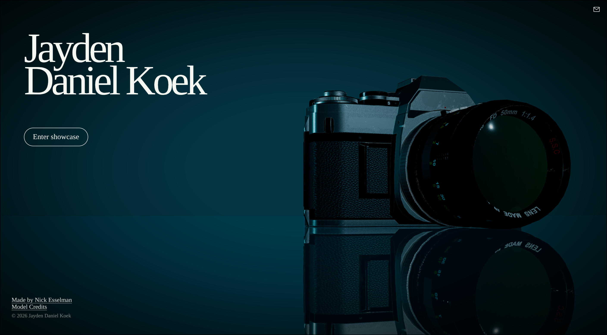
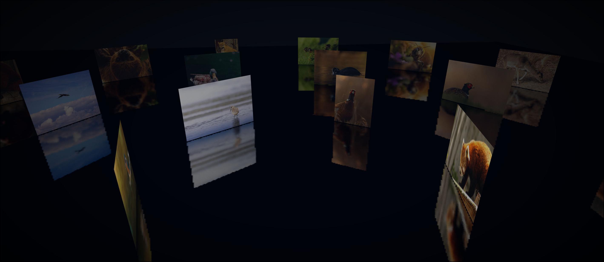

# Jayden Daniel Koek Photogrophy




This is a portfolio site for my good friend Jayden, a photographer. The homepage has a photo hero, a short biography and selected photographs. The Fotografie menu link opens a 3D gallery where visitors can walk through his nature and urban photographs. It is a project for [#beest](https://hackclub.com/).

the showcase is a 3d walking camera but the rotation pivot i put behind the camera so when walking left you right instead of being able to get lossed, you always rotate in a cirle when walking side to side.

The Over and Contact pages share the same full-screen menu. Biography, featured photos and contact links are editable in `src/lib/site/content.ts`. The email address is example content.

Most of the Ideas came to me at a friday night at 2am wide awake in bed XD

## Tech stack
- [SvelteKit](https://kit.svelte.dev/) for routing and the site shell
- [Threlte](https://threlte.xyz/) and [Three.js](https://threejs.org/) for the 3D scenes
- Blender for the camera and film assets
- Docker Compose for deployment

## Run locally

```bash
npm install
npm run dev
```

## Deploy with Docker

Create a local `.env` from the example:

```bash
cp .env.example .env
docker compose up --build -d
```

The container listens only on `127.0.0.1:3405`; place a reverse proxy in front of it for the public site. I made it this way to supprt my own caddy setup
